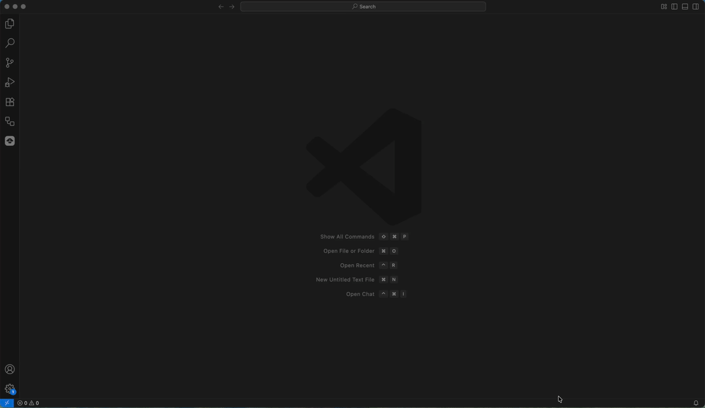
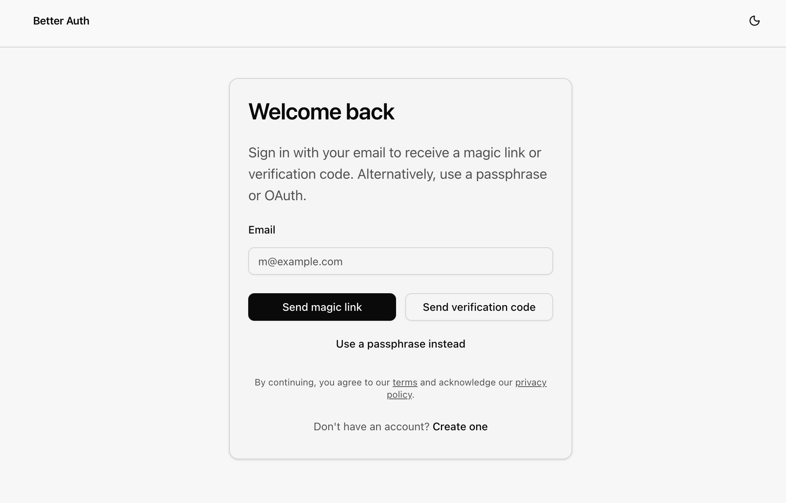
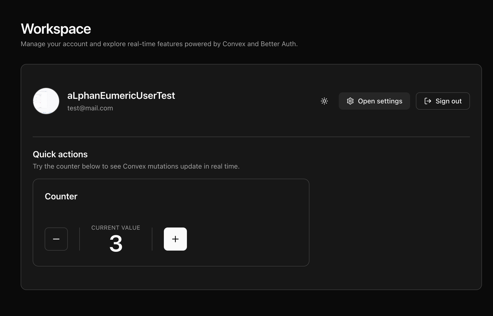
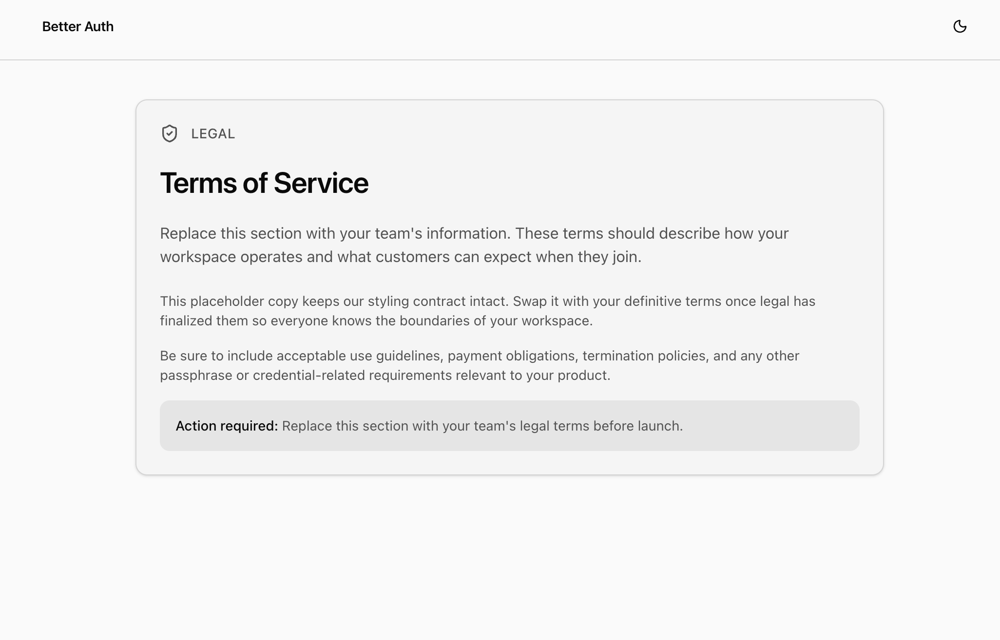
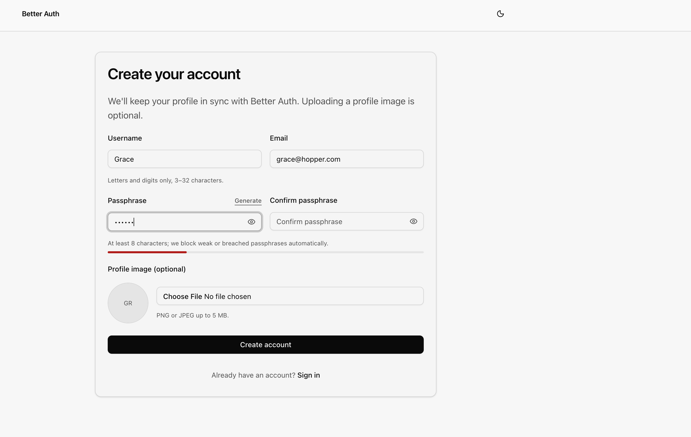
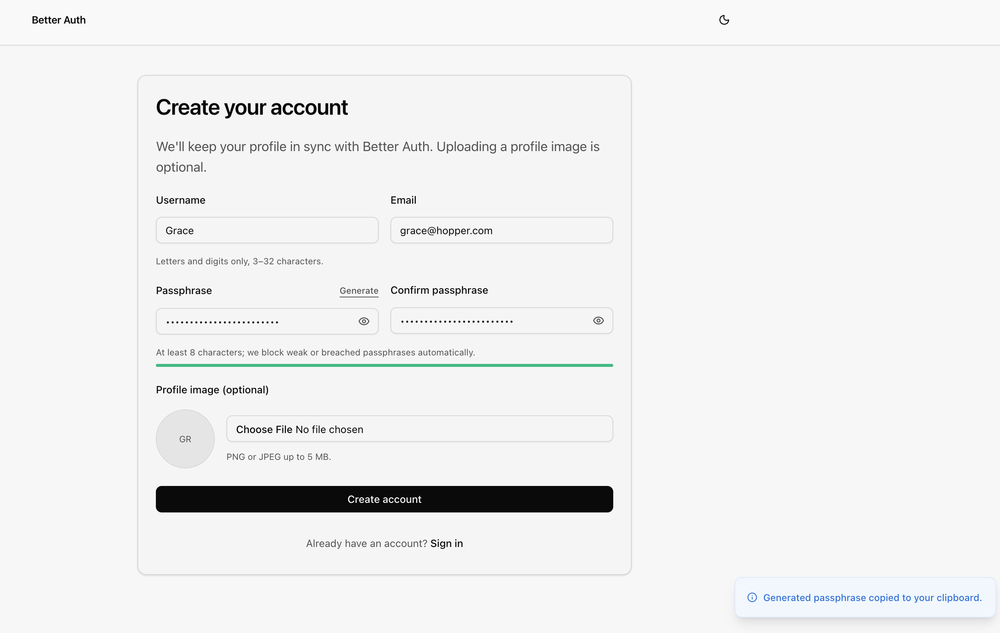
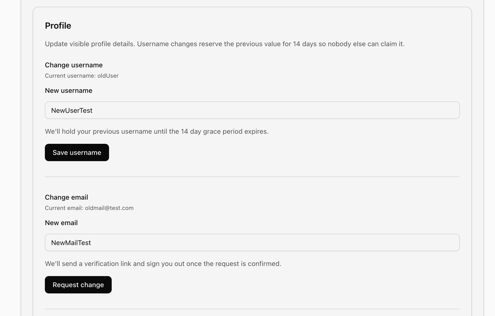

<h3 align="center">A rather comprehensive Better Auth + Convex Implementation</h3>

  <p align="center">
    Essentially a few lines of code you were likely to write anyways.
    <br />
    <br />
    &middot;
    <a href="https://github.com/Topfi/BetterAuth-Convex-9ui-shadcn-CLI-/issues">Report Bug</a>
    &middot;
    <a href="https://github.com/Topfi/BetterAuth-Convex-9ui-shadcn-CLI-/pulls">Make a Pull request</a>
  </p>
</div>

[](https://react.dev/)
[](https://vitejs.dev/)
[](https://www.convex.dev/)
[](https://www.better-auth.com/)
[](https://www.typescriptlang.org/)
[](https://www.9ui.dev/)
[](https://joinup.ec.europa.eu/collection/eupl/eupl-text-eupl-12)

A casual-but-capable Better Auth implementation that shows how Convex and React 19 play together, whilst keeping security and DX in mind. Ships with core flows wired up, well styled UI thanks to 9ui.dev, and enough polish that you can drop it into a demo or grow it into production.

## Quick Setup Video

<div align="center">
  
</div>

## Screenshots

| Welcome experience                                                    | Workspace overview                                                                | Terms view                                                                   |
| --------------------------------------------------------------------- | --------------------------------------------------------------------------------- | ---------------------------------------------------------------------------- |
|            |                    |                       |
| Passphrase strength feedback                                          | Generated passphrase modal                                                        | Profile settings surface                                                     |
|  |  |  |

## Features

- **🔐 Full auth**: passphrase sign-up/sign-in, passphrase resets, email verification, magic links, and one-time codes all reuse shared Zod schemas so the client and Convex agree on every payload.
- **🤝 Social sign-in + linking**: GitHub, Google, and Apple OAuth work out of the box once you drop in credentials, and the UI/helpers are ready for future providers. Account linking is enabled.
- **🛡️ Security niceties**: Email OTP plugin doubles as step-up verification, passphrase helpers centralize zxcvbn + Have I Been Pwned checks through the Better Auth plugin, enforce a 16+ character policy, and drive the shared color-coded strength meter.
- **🛠️ Scripts**: Simple one line setup and update scripts that guide you to a solid setup and ensure you are warned rather than accidentally overwriting remote envs.
- **📊 Rate limiting + audit trails**: Better Auths built-in limiter is persisted to Convex for consistent enforcement across pods, and destructive operations (like account deletion) append structured audit logs for later review.
- **✨ Productiion UX**: Sign-in/up cards follow the gradient shell, toast helpers map to severity colors, and the application header keeps avatars and primary actions (settings + sign-out) consistent.
- **🧩 Composable shell**: The authenticated experience is routed through a single layout so you can swap the default application without touching auth plumbing.
- **⚙️ Settings**: A dedicated settings surface lets users edit their profile, trigger email reverification, rotate passphrases with generators + breach checks, preview the soonTM to be implemented 2FA and export data flows, and do proper, comprehensive, allencompassing account deletion.
- **⏱️ Realtime counter sample**: Simple counter code using Convex [withOptimisticUpdate](https://docs.convex.dev/client/react/optimistic-updates), just so you have an easy way to check things are working.
- **✉️ Email preview/dev mode**: Flip one flag to dump verification, Magic Link and Code emails to the console for testing without Resend keys.
- **⏰ Cron Jobs**: I finally found a reason to dive into the [Cron](https://docs.convex.dev/scheduling/cron-jobs) support of Convex for temporary 24h claim of usernames during verification, so that was pretty neat.
- **🐣 Easter Egg**: I included a small, but very nerdy easter egg for you to find. I will probably add a env soon to turn it off, alongside the 2FA and data export feature.

## Why 9ui.dev

9ui.dev is a curated catalog of Base UI primitives dressed with Tailwind CSS that you copy into the repo instead of installing from npm. Now, that may sound very familiar to you and yes, it uses the same principle and even the CLI employed by shadcn/ui. So why not just rely on shadcn/ui over a far newer project? Partly, because the Base UI team (which does have prior experience working on Radix Primitives (the ones used by shadcn/ui), Material UI, and Floating UI) seem to essentially use this as a new starting point, using what worked and what may not have been so successful from their prior projects, which I find very appealing, considering how many times I have redone code in my time. Mainly though, if I'm being honest, I just like being early to new stuff and learning a project so early on has its appeal. Despite their young age, 9ui.dev and Base UI are already very mature and I enjoy them thouroughly. Incedentally,it is 01:52 AM whilst I am typing these words, and I only now realised that 9ui isn't just randomly named. Yeah, I should probably go to bed soon...

And yes, of course, you can easily go back to plain old shadcn/ui with Radix primitives, heck they even use the same CLI, but I'd honestly advise you to give Base UI and 9ui.dev a chance.

## Why zxcvbn + Have I Been Pwned

zxcvbn has been my choice because it encodes so much practical knowledge about how people actually assemble passphrases. Pairing that with Have I Been Pwned just makes sense: if the zxcvbn score tells you how resilient your passphrase might be, HIBP tells you whether the exact string has already been a part of one of the many data breaches we somehow have just come to accept. I've been following Troy Hunts work since the early 2010s (thanks to SemperVideo back in the day), long enough to see the steady stream of "why did you hack me" mails he still receives despite repeatedly explaining what the service actually does. Anyone who keeps volunteering that kind of community service in the face of persistent misunderstandings can be relied upon in my book. The fact that there is an amazingly handy HIBP plugin for Better Auth which made this basically a five line process is of course a pure coincidence...

## Why Better Auth

Yes, Better Auth is new and that will, worringly, always attract me to some extend, but it does help that the team really seems to have DX in mind, on top of solid defaults for security. Convex integration becoming more solid by the day, along with those plugins I mentioned before, made it comparatively straight forward, dare I say it, pleasant (a word that generally doesn't come within the same stratosphere as auth). What also helped was a Hackathon I stumbled across a few days ago (when this repo first goes public) and a lot of Sodastream Pepsi Max. Like, a medically inadvisable amount.

## Stack Snapshot

- React 19 with the React Compiler + Vite 7
- Convex backend with Better Auth server plugin suite (magic link, email OTP, account linking, cross-domain)
- Base UI primitives + Tailwind CSS v4 curtesy of 9ui.dev (under `src/components/ui`)
- React Hook Form + Zod for synced validation, again thanks to 9ui.dev
- Vitest + Testing Library for unit and component coverage

## Getting Started

### Prerequisites

- The Convex CLI (`npm install -g convex` or use `npx convex ...`) to log into your Convex account.
- Resend API key if you want to send real mail (optional in development).
- OTP API key if you want to use Google, Github or Apple OAuth.

### Setup

1. Bootstrap dependencies, Convex metadata, and `.env.local` defaults:

   ```bash
   npm run setup
   ```

   This script installs all packages (`npm install`), builds the shared project and then calls `npx convex dev --once` to initialize your Convex deployment, rotates `BETTER_AUTH_SECRET` (base64) and extends `.env.local`.

<details>
  <summary>More info</summary>

```bash
# Core deployment settings used by Convex CLI and Better Auth.
# Example: dev:team-slug-1234 (run `npx convex dev` to get your deployment slug).
CONVEX_DEPLOYMENT=dev:team-slug-1234

# Public Convex site URL (https://<deployment>.convex.site). Required for Better Auth middleware.
# Example: https://team-slug-1234.convex.site
CONVEX_SITE_URL=https://team-slug-1234.convex.site

# Client-side Convex URL (https://<deployment>.convex.cloud) consumed by ConvexReactClient.
# Example: https://team-slug-1234.convex.cloud
VITE_CONVEX_URL=https://team-slug-1234.convex.cloud

# Browser-accessible Convex site URL (must end in .site) used by the Better Auth client.
# Example: https://team-slug-1234.convex.site
VITE_CONVEX_SITE_URL=https://team-slug-1234.convex.site

# Base URL for the web app during local development. Must be the origin (protocol + host + port).
# Example: http://localhost:5173
VITE_SITE_URL=http://localhost:5173

# Server-visible site origin used for email links and trusted origins in Better Auth.
# Example: http://localhost:5173
SITE_URL=http://localhost:5173

# 32+ character secret shared with Better Auth (generate via `node -e "console.log(require('crypto').randomBytes(32).toString('base64'))"`).
# Local dev only: keep this in `.env.local`; setup/update scripts sync it to Convex and do not read remote values back.
BETTER_AUTH_SECRET=REPLACE_WITH_32_CHAR_SECRET

# GitHub OAuth toggle. Use `true` to expose the button, `false` to hide it.
# Example: true
GITHUB_OAUTH=false

# GitHub OAuth application client ID (letters/digits/./_/ - from https://github.com/settings/developers).
# Example: Iv1.0123456789abcdef
GITHUB_CLIENT_ID=

# GitHub OAuth application client secret (>=10 characters from the GitHub developer portal).
# Example: gho_exampleSuperSecret123456
GITHUB_CLIENT_SECRET=

# Google OAuth toggle. Use `true` to expose the button, `false` to hide it.
# Example: false
GOOGLE_OAUTH=false

# Google OAuth client ID from Google Cloud console (ends with .apps.googleusercontent.com).
# Example: 1234567890-abcdefghi123456789.apps.googleusercontent.com
GOOGLE_CLIENT_ID=

# Google OAuth client secret from Google Cloud console.
# Example: GOCSPX-exampleSecretValue123456
GOOGLE_CLIENT_SECRET=

# Apple Sign In toggle. Use `true` to expose the button, `false` to hide it.
# Example: false
APPLE_OAUTH=false

# Apple Sign In service identifier (Service ID / client ID from Apple Developer portal).
# Example: com.example.yourapp.service
APPLE_CLIENT_ID=

# Apple Sign In client secret (JWT generated with your .p8 key, Key ID, and Team ID).
# Example: eyJhbGciOiJFUzI1NiIsInR5cCI6IkpXVCJ9...<truncated>
APPLE_CLIENT_SECRET=

# Optional: native app bundle identifier for Sign In with Apple when exchanging ID tokens.
# Example: com.example.yourapp
APPLE_APP_BUNDLE_IDENTIFIER=

# Mail preview toggle. `true` logs emails to the console; `false` sends via Resend.
# Example: true
MAIL_CONSOLE_PREVIEW=true

# Resend API key (required when MAIL_CONSOLE_PREVIEW=false). Starts with `re_`.
# Example: re_abcd1234efgh5678ijkl9012mnop3456
RESEND_API_KEY=

# From address for all transactional emails. Use `Name <email@example.com>` format.
# Example: Product Team <hello@example.com>
MAIL_FROM=Product Team <hello@example.com>

# Optional brand metadata for email templates.
# Example: Better Auth Playground
BRAND_NAME=

# Optional brand logo URL (must start with http:// or https://).
# Example: https://example.com/assets/logo.svg
BRAND_LOGO_URL=

# Optional brand tagline rendered in email footers.
# Example: Secure access for modern teams.
BRAND_TAGLINE=

# Optional: toggle Better Auth's Convex-backed rate limiting. Defaults to true in production.
# Example: true
BETTER_AUTH_RATE_LIMIT_ENABLED=true
```

Note: Client-side values stay in `.env.local`, while server settings are mirrored into your Convex environment via `npx convex env set` so they are aligned.

</details>

2. Start both the frontend and Convex dev server:

   ```bash
   npm run dev
   ```

   - The app now runs at `http://localhost:5173`.
   - Re-run `npm run update-envs` whenever you tweak the .env.local to apply the same changes to your Convex deploment.

## Adapting to Your Own App

1. Swap `src/components/Counter.tsx` (wired up in `src/App.tsx`) with your own feature component or route tree.
2. Put any shared schemas or helpers in `shared/<feature>.ts`.
3. Build UI with primitives from `src/components/ui`.

Follow these steps and you can drop in a bespoke React surface without disturbing authentication or Convex wiring.

### Helpful Scripts

- `npm run setup` – installs all packages (`npm install`), runs `npm run generate` (builds the shared project and then calls `npx convex dev --once`) to initialize your Convex deployment, rotates `BETTER_AUTH_SECRET` (base64) and extends `.env.local`.
- `npm run update-envs` – pushes env values to Convex without reinstalling.
- `npm run check` – runs guardrails and the consistency checker, typechecks the entire project, enforces ESLint and Prettier, and executes Vitest with verbose reporting.
- `npm run audit` – repeats the guardrail stack, performs Secretlint, runs gitleaks in redact mode, and triggers `npm audit` at moderate severity for production dependencies.

## Environment Reference

| Variable                         | Scope          | Purpose                                                                                            |
| -------------------------------- | -------------- | -------------------------------------------------------------------------------------------------- |
| `CONVEX_DEPLOYMENT`              | Local + Convex | Links the repo to the correct Convex deployment slug so CLI commands target the right environment. |
| `CONVEX_SITE_URL`                | Convex         | Public `.site` domain Convex issues; Better Auth uses it for middleware callbacks.                 |
| `VITE_CONVEX_URL`                | Local          | Browser-consumable Convex endpoint used by the client SDK for queries and mutations.               |
| `VITE_CONVEX_SITE_URL`           | Local          | Mirrors `CONVEX_SITE_URL` for the browser so auth flows can reach Convex-hosted routes.            |
| `VITE_SITE_URL`                  | Local          | Origin served by Vite during development; Better Auth uses it to craft local auth links.           |
| `SITE_URL`                       | Convex         | Server-visible origin for email links and CORS validation inside Convex functions.                 |
| `BETTER_AUTH_SECRET`             | Local + Convex | Shared secret Better Auth uses to sign tokens; generated locally and synced to Convex.             |
| `GITHUB_OAUTH`                   | Local + Convex | Feature flag enabling the GitHub button in the Better Auth UI.                                     |
| `GITHUB_CLIENT_ID`               | Local + Convex | GitHub OAuth application identifier consumed by the Better Auth GitHub provider.                   |
| `GITHUB_CLIENT_SECRET`           | Convex         | Confidential GitHub secret stored server-side for token exchange.                                  |
| `GOOGLE_OAUTH`                   | Local + Convex | Toggles the Google provider on the sign-in surface.                                                |
| `GOOGLE_CLIENT_ID`               | Local + Convex | Google OAuth client ID from Google Cloud; required for the Google button.                          |
| `GOOGLE_CLIENT_SECRET`           | Convex         | Google OAuth secret stored server-side for token exchanges.                                        |
| `APPLE_OAUTH`                    | Local + Convex | Enables the Sign in with Apple entry point.                                                        |
| `APPLE_CLIENT_ID`                | Local + Convex | Apple service identifier forwarded to Better Auth when Apple auth is active.                       |
| `APPLE_CLIENT_SECRET`            | Convex         | JWT secret Apple requires for token exchange; never shipped to the browser.                        |
| `APPLE_APP_BUNDLE_IDENTIFIER`    | Convex         | Optional native bundle identifier used when exchanging Apple ID tokens.                            |
| `MAIL_CONSOLE_PREVIEW`           | Local + Convex | When true routes Better Auth mailers to console logs; disable to send via Resend.                  |
| `RESEND_API_KEY`                 | Convex         | API key for Resend; required when mail preview is disabled.                                        |
| `MAIL_FROM`                      | Local + Convex | Default `From` header applied to all transactional emails.                                         |
| `BRAND_NAME`                     | Local + Convex | Optional brand label injected into email templates.                                                |
| `BRAND_LOGO_URL`                 | Local + Convex | Optional HTTPS logo URL rendered in email headers.                                                 |
| `BRAND_TAGLINE`                  | Local + Convex | Optional footer copy for transactional emails.                                                     |
| `BETTER_AUTH_RATE_LIMIT_ENABLED` | Local + Convex | Controls the Convex-backed rate limiter Better Auth ships with.                                    |

## Testing

Run `npm run check` and `npm run audit` for some simple checks (gitleak, vitest, prettier, etc.). Run both before you push or open a PR. Tests live beside the file covered (e.g. `src/features/counter/components/Counter.spec.tsx`).

## Project Layout

```
BetterAuthEval/
├── README.md
├── components.json
├── convex/
│   ├── http.ts
│   └── (Convex functions grouped by feature)
├── public/
│   └── screenshots and videos for readme
├── scripts/
│   ├── setup.mjs
│   └── update-envs.mjs
├── shared/
│   └── feature-aligned Zod schemas, helpers, and types
├── src/
│   ├── components/
│   ├── features/
│   ├── routes/
│   └── providers/
├── package.json
└── vite.config.ts
```
